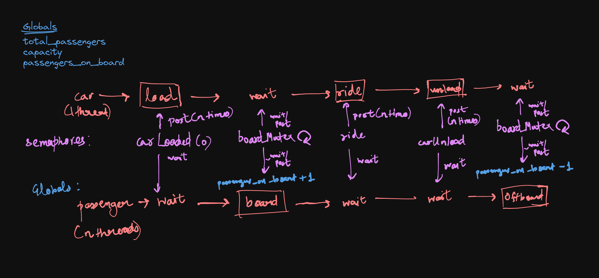

# Q1 - Dining Philosophers 
## Why can deadlocks occur?
- Deadlocks can occur when all philosophers acquire the left fork first. This will cause all philosophers to be stuck waiting for the right fork. 
- If some philosophers acquire the bowls first, and the others acqure the forks first or vice-versa then deadlock will occur since all conditions for eating will never be met.

## How our solution avoids deadlocks
- It is necessary that there is a fixed order between acquiring forks and bowls. In our implementation, forks are _always_ acquired before bowls. This is to prevent deadlock. If a philosopher acquires a bowl before a fork, it is possible that the philosopher will be stuck waiting for a fork that is held by another philosopher. This is a deadlock.
- to avoid deadlock when all philosophers acquire the left fork first, we can have one philosopher acquire the right fork first. This will prevent the deadlock from happening.
- a mutex is used to prevent multiple philosophers from acquiring the same fork/bowl at the same time. 

## Why our solution is starvation free
- In our solution, when a philosopher is done thinking and eating, it puts down both forks and waits for some time before trying to eat again. This makes sure other philosophers do not starve.
- A philosopher does not have to wait for a specific bowl, it can eat from any bowl that is available. This also reduces the chances of starvation.
- Also, since the number of philosophers is finite and not too big in this case (5) and the sleep time is random within a limit, it is very probable that eventually, all philosophers will get a chance to eat.

## Implementation details
- Bowls have been implemented using a single conditional variable which signals/waits for any bowl that is available. An integer array is used to keep track of which bowls are available and which bowl is held by which philosopher. Each philosopher loops through the array and checks if a bowl is available; if not it waits for the conditional variable to be signalled. When a philosopher is done eating, it puts down both forks and bowls (the array is updated) and signals the conditional variable. After the conditional variable is signalled and the code resumes, we loop through the array again to check which bowl was made available and update the array again.
- For forks, there is a conditional variable for each fork. Each philosopher waits for its respective left and right fork (in that order). The conditional variable of the respective fork is signaled when the fork is put down. 

# Q2 - Car and passengers

## Implementation details
-- the loop goes on infinitely
#### Globals
- `capacity`: the number of passengers that can be loaded into the car at a time
- `total_passengers`: the total number of passengers
- `passengers_on_board`: the number of passengers on board at a given time

#### Semaphores
- there are 4 semaphores being used - `ride`, `carLoaded`, `carUnloaded`, `boardMutex`
  - `carLoaded`: is used to signal passengers that the car has been loaded. Each passenger initially waits on this semaphore. When the car is loaded, the car thread signals this `capacity` number of times to signal each passenger and to let each passenger thread now that the car has been loaded.
  -  `boardMutex`: is a binary semaphore that is used to change `passengers_on_board` atomically. It is used to decrease/increase the number of passengers on board.
  -  `ride`: is used to signal the passengers that the ride has completed. Each passenger waits on this semaphore. When the ride is completed, the car thread signals this `capacity` number of times to signal each passenger and to let each passenger thread now that the ride has completed.
  -  `carUnloaded`: is used to signal the passengers that the car has been unloaded. Each passenger waits on this semaphore. When the car is unloaded, the car thread signals this `capacity` number of times to signal each passenger and to let each passenger thread now that the car has been unloaded.

  

## How concurrency bugs are avoided
- We use binary semaphores (mutexes) to ensure mutual exclusion when changing the number of passengers on board and handling critical sections.
- We use semaphores to signal/wait for the car to be loaded, unloaded and for the ride to be completed. This ensures that the car is loaded/unloaded only when the passengers are ready and the ride is completed only when the car is loaded. This avoids any race conditions.

# Q3 - Bridge crossing
## Assumptions
- In our solution, cars always begin crossing from the left side first unless there are no cars on the left side. 
- Maximum possible number of cars cross the bridge at a time, alternating between both directions.

## Implementation details
- We use a `crossing_left` and `crossing_right` semaphore to wait for cars to cross the bridge. These semaphores are used to signal the cars that are waiting on the other side of the bridge.
- We use a binary semaphore `mutex` to ensure mutual exclusion when changing the number of cars on the bridge and handling critical sections.
- We keep a track of how many cars have crossed in the current direction and how many are remaninig and switching sides when necessary. This is done using `count_in_direction`, `remaining_right`, `remaining_left` variables.

## How concurrency bugs are avoided
- We use binary semaphores to ensure mutual exclusion in critical sections of the code.
- Semaphores are used to make sure only cars from one direction cross at a given time and the cars in the opposite direction wait on a semaphore till then. 